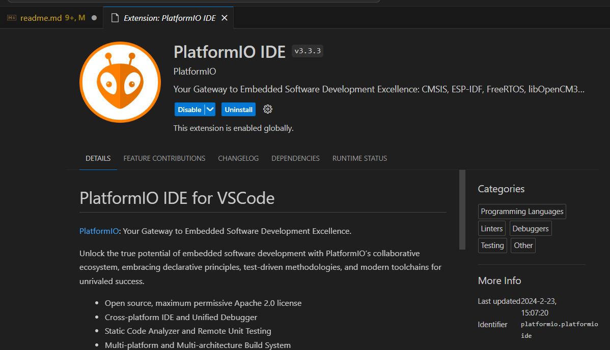
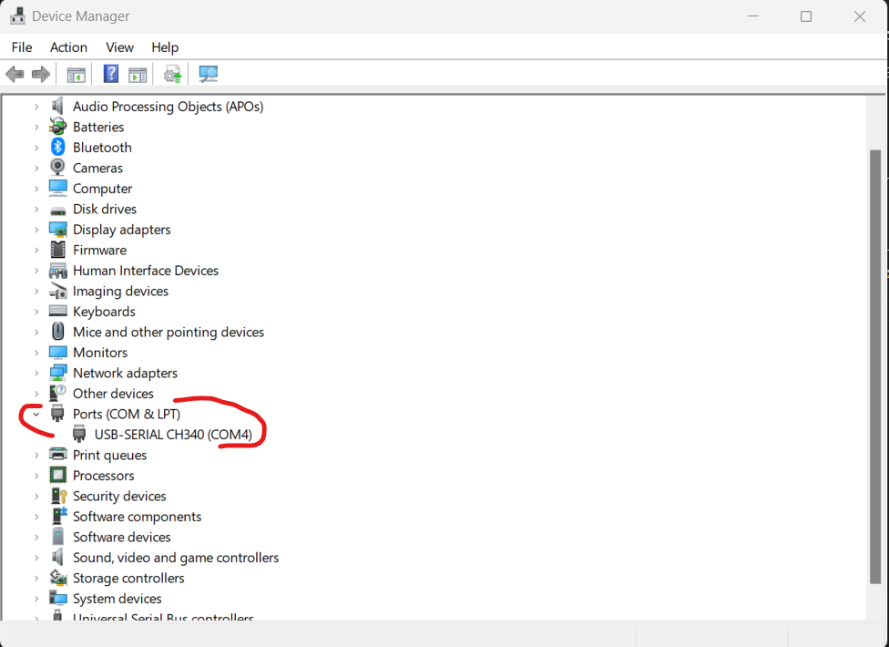

# My Atmega328 microchip projects

## Getting started

1. I bought this third party arduino uno board because this was cheap- https://amzn.eu/d/3zFV4so


2. This software will come handy in laying out the circuit- https://www.cirkitstudio.com/download.html

3. Install this VScode extension - PlatformIO IDE, (along with this C/C++ and C/C++ Extension pack will get installed and that is fine)



## Some Debugging 

Issue- While uploading my code to this third party controller I faced some issues (these issues are still there but by following few steps this get resolve)

1. When we connect this atmega328 it will automatically install some CH340 drivers but it is better if you install it manually by downloading from online, I used this website - https://sparks.gogo.co.nz/ch340.html



and this COM4 here keep changing in Windows

2. When you will create a new project one platformio.ini file will be created make sure to it alway contain `upload_flags = -F` example of this file is bellow, 

```ini
[env:ATmega328]
platform = atmelavr
board = ATmega328
framework = arduino
upload_flags = -F
lib_deps = 
	Adafruit RTC
	adafruit/RTClib@^2.1.3
	SPI

```

3. Before uploading the code check the code by doing `Built`
4. If upload code don't work even by doing above close the VScode, remove the board's cable and then insert agin into different port and open the vscode go to PlatformIO open the project.  

## Project documentations

### First_project_atmega328_blinkled


###